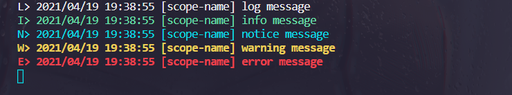

# 日志

日志对于 Web 开发的重要性毋庸置疑，它对于监控应用的运行状态、问题排查等都有非常重要的意义。
## 日志级别
日志分为 `log`，`info`，`notice`，`warn` 和 `error` 5 个级别。

`nodex-libs`支持基于pm2的日志输出，在使用 [nodex-cli](../cli.md) 生成的项目中引入pm2的进程管理工具。

日志打印到文件中的同时，为了方便开发，也会同时打印到终端中。

其中init()中传入的值为日志的前缀标签。


```js
const libs = require('nodex-libs');
libs.log.init('scope-name');

console.log(`log message`);
console.info(`info message`);
console.notice('notice message');
console.warn(`warning message`);
console.error(`error message`);
```

## 结果
