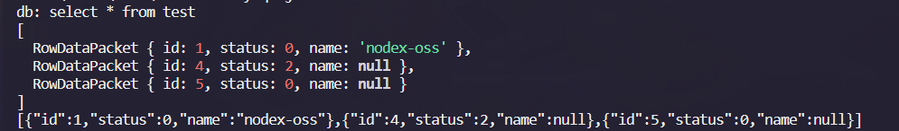
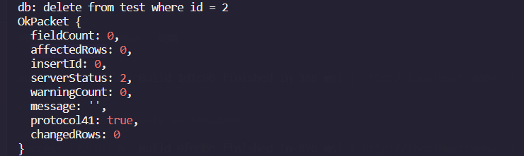

# 数据库
在 Web 应用方面,数据库尤为重要，`nodex-libs` 同时支持MySQL和MongoDB两种数据库。

## MySQL
框架提供了简洁的基于mysql连接池的数据库操作，支持mysql事务处理。

**初始化全局MySql对象**

````js
const libs = require('nodex-libs');
const mysql = libs.mysql;

// 初始化全局MySql对象
mysql.init({
    // host
    host: '127.0.0.1',
    // 端口号
    port: 3306,
    // 用户名
    user: 'root',
    // 密码
    password: '123456',
    // 要查询的数据库名称
    database: 'test'
});

````

**使用方法**

````js
{
    let sql = 'select * from test';
    let list = await mysql.query(sql);
    console.log(list);
    console.log(JSON.stringify(list));
}

{
    let sql = 'delete from test where id = 0';
    let ret = await mysql.query(sql);
    console.log(ret.affectedRows);
}
````

**结果**

如上执行上面的两个代码块，第一个为查询数据库中test表的所有数据，第二个是删除id为2的数据。


从数据库查询出来的数据为一个数组，可使用`JSON.stringify()`转换为json格式。


当从数据库删除一个数据时，将返回一个对象，其中`affectedRows`表示数据则操作是否成功，为1时表示成功，为0则表示失败。 如下删除id为2的数据，上面查询并无id为2的数据，故删除失败`affectedRows`则为0，表示操作失败。




